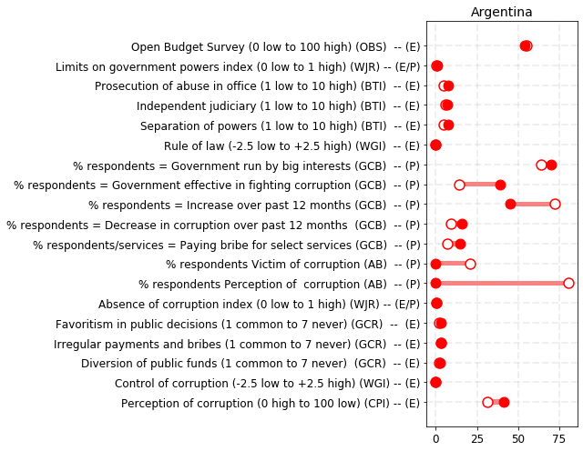
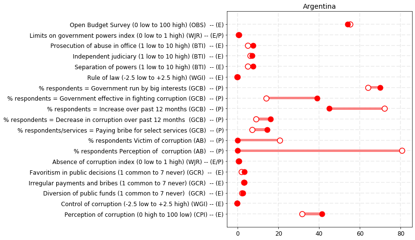
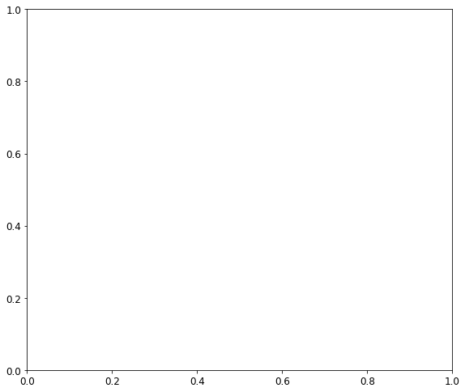
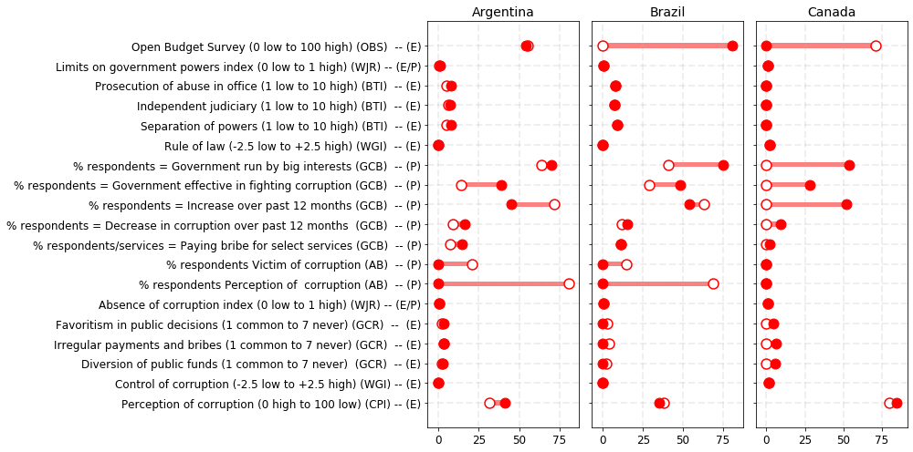
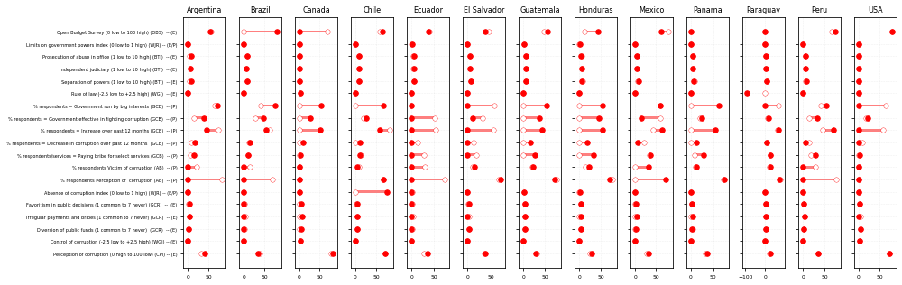

    ['Argentina',
     'Brazil',
     'Canada',
     'Chile',
     'Ecuador',
     'El Salvador',
     'Guatemala',
     'Honduras',
     'Mexico',
     'Panama',
     'Paraguay',
     'Peru',
     'USA']

<table border="1" class="dataframe">
  <thead>
    <tr style="text-align: right;">
      <th></th>
      <th>Area / Measure (experts/public)</th>
      <th>Left</th>
      <th>Right</th>
      <th>Dif</th>
      <th>Abs</th>
      <th>Origin</th>
    </tr>
  </thead>
  <tbody>
    <tr>
      <td>0</td>
      <td>Perception of corruption (0 high to 100 low) (...</td>
      <td>31.50</td>
      <td>41.30</td>
      <td>9.80</td>
      <td>9.80</td>
      <td>31.50</td>
    </tr>
    <tr>
      <td>1</td>
      <td>Control of corruption (-2.5 low to +2.5 high) ...</td>
      <td>-0.39</td>
      <td>-0.24</td>
      <td>0.15</td>
      <td>0.15</td>
      <td>-0.39</td>
    </tr>
    <tr>
      <td>2</td>
      <td>Diversion of public funds (1 common to 7 never...</td>
      <td>2.09</td>
      <td>2.40</td>
      <td>0.31</td>
      <td>0.31</td>
      <td>2.09</td>
    </tr>
    <tr>
      <td>3</td>
      <td>Irregular payments and bribes (1 common to 7 n...</td>
      <td>2.98</td>
      <td>3.30</td>
      <td>0.32</td>
      <td>0.32</td>
      <td>2.98</td>
    </tr>
    <tr>
      <td>4</td>
      <td>Favoritism in public decisions (1 common to 7 ...</td>
      <td>1.90</td>
      <td>3.20</td>
      <td>1.30</td>
      <td>1.30</td>
      <td>1.90</td>
    </tr>
    <tr>
      <td>5</td>
      <td>Absence of corruption index (0 low to 1 high) ...</td>
      <td>0.48</td>
      <td>0.52</td>
      <td>0.04</td>
      <td>0.04</td>
      <td>0.48</td>
    </tr>
    <tr>
      <td>6</td>
      <td>% respondents Perception of  corruption (AB)  ...</td>
      <td>80.70</td>
      <td>0.00</td>
      <td>-80.70</td>
      <td>80.70</td>
      <td>0.00</td>
    </tr>
    <tr>
      <td>7</td>
      <td>% respondents Victim of corruption (AB)  -- (P)</td>
      <td>20.70</td>
      <td>0.00</td>
      <td>-20.70</td>
      <td>20.70</td>
      <td>0.00</td>
    </tr>
    <tr>
      <td>8</td>
      <td>% respondents/services = Paying bribe for sele...</td>
      <td>7.00</td>
      <td>14.50</td>
      <td>7.50</td>
      <td>7.50</td>
      <td>7.00</td>
    </tr>
    <tr>
      <td>9</td>
      <td>% respondents = Decrease in corruption over pa...</td>
      <td>9.00</td>
      <td>16.00</td>
      <td>7.00</td>
      <td>7.00</td>
      <td>9.00</td>
    </tr>
    <tr>
      <td>10</td>
      <td>% respondents = Increase over past 12 months (...</td>
      <td>72.00</td>
      <td>45.00</td>
      <td>-27.00</td>
      <td>27.00</td>
      <td>45.00</td>
    </tr>
    <tr>
      <td>11</td>
      <td>% respondents = Government effective in fighti...</td>
      <td>14.00</td>
      <td>39.00</td>
      <td>25.00</td>
      <td>25.00</td>
      <td>14.00</td>
    </tr>
    <tr>
      <td>12</td>
      <td>% respondents = Government run by big interest...</td>
      <td>64.00</td>
      <td>70.00</td>
      <td>6.00</td>
      <td>6.00</td>
      <td>64.00</td>
    </tr>
    <tr>
      <td>13</td>
      <td>Rule of law (-2.5 low to +2.5 high) (WGI)  -- (E)</td>
      <td>-0.28</td>
      <td>-0.17</td>
      <td>0.11</td>
      <td>0.11</td>
      <td>-0.28</td>
    </tr>
    <tr>
      <td>14</td>
      <td>Separation of powers (1 low to 10 high) (BTI) ...</td>
      <td>5.00</td>
      <td>7.50</td>
      <td>2.50</td>
      <td>2.50</td>
      <td>5.00</td>
    </tr>
    <tr>
      <td>15</td>
      <td>Independent judiciary (1 low to 10 high) (BTI)...</td>
      <td>6.00</td>
      <td>7.00</td>
      <td>1.00</td>
      <td>1.00</td>
      <td>6.00</td>
    </tr>
    <tr>
      <td>16</td>
      <td>Prosecution of abuse in office (1 low to 10 hi...</td>
      <td>5.00</td>
      <td>7.50</td>
      <td>2.50</td>
      <td>2.50</td>
      <td>5.00</td>
    </tr>
    <tr>
      <td>17</td>
      <td>Limits on government powers index (0 low to 1 ...</td>
      <td>0.47</td>
      <td>0.62</td>
      <td>0.15</td>
      <td>0.15</td>
      <td>0.47</td>
    </tr>
    <tr>
      <td>18</td>
      <td>Open Budget Survey (0 low to 100 high) (OBS)  ...</td>
      <td>55.20</td>
      <td>54.00</td>
      <td>-1.20</td>
      <td>1.20</td>
      <td>54.00</td>
    </tr>
  </tbody>
</table>

    /Users/jnicolas/opt/anaconda3/lib/python3.7/site-packages/ipykernel_launcher.py:35: UserWarning: Tight layout not applied. The left and right margins cannot be made large enough to accommodate all axes decorations. 

    [NbConvertApp] Converting notebook Untitled.ipynb to html
    [NbConvertApp] Writing 709932 bytes to Untitled.html

